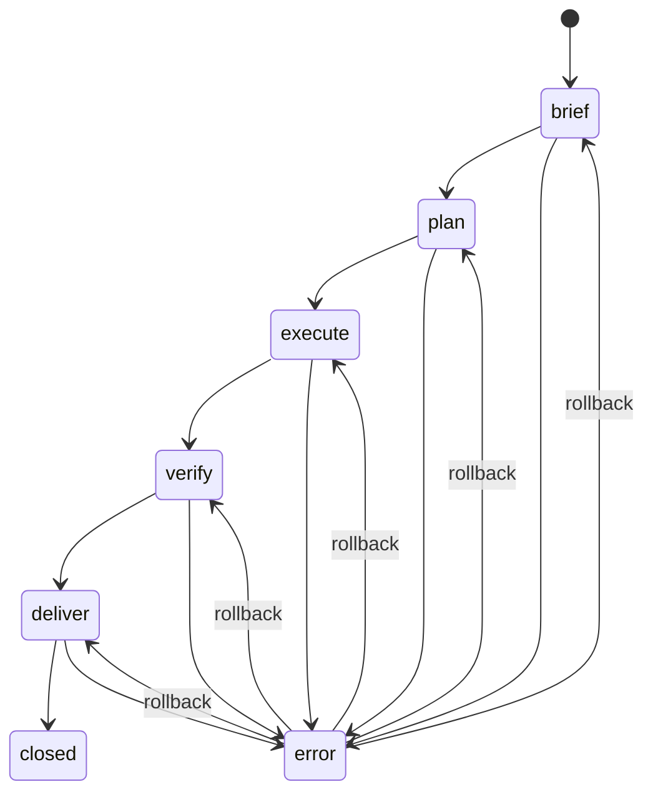

# Mission State Machine (P1 #29)

The Mission Runner uses a persistent state machine to ensure mission execution is **ordered**, **resumable**, and **auditable**.

## Phases

Primary phases:

- `brief` → `plan` → `execute` → `verify` → `deliver` → `closed`

Additional phase:

- `error` — terminal unless rolled back by a human/operator

## Mermaid Diagram

## Persistence

Default persistence uses `JsonFileMissionStore`:

- State file: `~/clawd/ventureos/runtime/missions/state/<missionId>.json`
- Atomic writes: write to `*.tmp` then rename

The stored record includes:

- phase + timestamps
- brief/plan/execution/verification/delivery payloads
- history entries (phase transitions)
- error info (when applicable)
- basic metrics (duration, optional tokens/cost)

## Rollback

Rollback is only allowed from `error` and only to phases present in history.
This is designed to keep the state machine safe and auditable.
