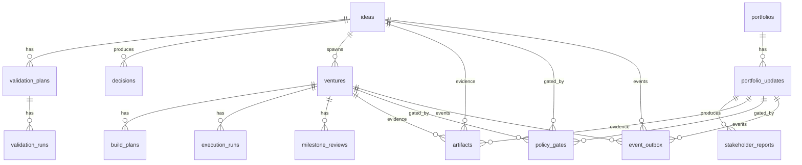

# VentureOS Data Model Draft + ERD (M0)

**Source of truth:** `/specs/VentureOS_Spec_Pack.md` and `/docs/process/Requirements_and_Scope.md`  
**Purpose:** Draft logical data model aligned to M0 workflows, stack, and gate/evidence requirements.

---

## 1) Modeling Conventions (M0)
- **Primary keys:** `id` as UUID (generated by app/service).  
- **Timestamps:** `created_at` required; `updated_at` optional but recommended; `completed_at/published_at` when applicable.  
- **Status fields:** constrained to the shared **Status** taxonomy: `Draft | InReview | Approved | Rejected | Active | Paused | Completed | Failed | Archived`.  
- **JSON fields:** use `*_json` for flexible payloads (metrics, milestones, metadata).  
- **Polymorphic links:** `artifacts` and `policy_gates` attach to multiple entity types via (`entity_type`, `entity_id`) or (`parent_type`, `parent_id`). Enforced at app layer with referential checks.
- **Identity:** `owner_id`, `approved_by`, `actor_id` are **Keycloak subject IDs** (external identity provider); DB may not enforce FK.

---

## 2) Entity List (Fields + Relationships + Constraints)

### 2.1 ideas
**Fields**
- `id` (uuid, PK)
- `title` (text, not null)
- `owner_id` (text, not null) — Keycloak subject
- `status` (enum, not null)
- `risk_level` (enum: Low|Medium|High|Critical)
- `priority` (enum: P0|P1|P2|P3)
- `tags` (text[] or jsonb)
- `created_at` (timestamptz, not null)
- `updated_at` (timestamptz)

**Relationships**
- 1→many with `validation_plans`
- 1→many with `decisions`
- 1→many with `ventures` (approved ideas spawn ventures)
- polymorphic 1→many with `artifacts`, `policy_gates`, `event_outbox`

**Constraints**
- `status` must follow workflow state machine (enforced by service)
- `title` non-empty

---

### 2.2 validation_plans
**Fields**
- `id` (uuid, PK)
- `idea_id` (uuid, FK → ideas.id, not null)
- `hypothesis` (text, not null)
- `success_metrics` (text or jsonb)
- `timeline` (text or daterange)
- `status` (enum, not null)
- `created_at` (timestamptz, not null)
- `updated_at` (timestamptz)

**Relationships**
- many→1 `ideas`
- 1→many `validation_runs`
- polymorphic 1→many `artifacts`, `policy_gates`, `event_outbox`

**Constraints**
- `idea_id` must exist
- one **active** plan per idea at a time (unique partial index)

---

### 2.3 validation_runs
**Fields**
- `id` (uuid, PK)
- `plan_id` (uuid, FK → validation_plans.id, not null)
- `outcome` (text or enum: success|fail|inconclusive)
- `metrics_json` (jsonb)
- `status` (enum, not null)
- `completed_at` (timestamptz)
- `created_at` (timestamptz, not null)

**Relationships**
- many→1 `validation_plans`
- polymorphic 1→many `artifacts`, `policy_gates`, `event_outbox`

**Constraints**
- `completed_at` required when status in (Completed, Failed)

---

### 2.4 decisions
**Fields**
- `id` (uuid, PK)
- `idea_id` (uuid, FK → ideas.id, not null)
- `outcome` (enum: Go|Iterate|Kill)
- `rationale` (text, not null)
- `approved_by` (text) — Keycloak subject
- `status` (enum, not null)
- `created_at` (timestamptz, not null)

**Relationships**
- many→1 `ideas`
- polymorphic 1→many `artifacts`, `policy_gates`, `event_outbox`

**Constraints**
- `outcome` required when status is Approved/Rejected/Revise
- approval requires all required gates passed and evidence attached (app-layer)

---

### 2.5 ventures
**Fields**
- `id` (uuid, PK)
- `idea_id` (uuid, FK → ideas.id, not null)
- `owner_id` (text, not null)
- `status` (enum, not null)
- `budget` (numeric)
- `priority` (enum: P0|P1|P2|P3)
- `created_at` (timestamptz, not null)
- `updated_at` (timestamptz)

**Relationships**
- many→1 `ideas`
- 1→many `build_plans`, `execution_runs`, `milestone_reviews`
- polymorphic 1→many `artifacts`, `policy_gates`, `event_outbox`

**Constraints**
- unique `idea_id` (one venture per approved idea)

---

### 2.6 build_plans
**Fields**
- `id` (uuid, PK)
- `venture_id` (uuid, FK → ventures.id, not null)
- `milestones_json` (jsonb, not null) — list of milestone objects
- `status` (enum, not null)
- `approved_by` (text)
- `created_at` (timestamptz, not null)

**Relationships**
- many→1 `ventures`
- polymorphic 1→many `artifacts`, `policy_gates`, `event_outbox`

**Constraints**
- one **active** build plan per venture (unique partial index)
- `milestones_json` must include milestone IDs referenced by reviews

---

### 2.7 execution_runs
**Fields**
- `id` (uuid, PK)
- `venture_id` (uuid, FK → ventures.id, not null)
- `sprint_no` (int)
- `status` (enum, not null)
- `metrics_json` (jsonb)
- `created_at` (timestamptz, not null)
- `completed_at` (timestamptz)

**Relationships**
- many→1 `ventures`
- polymorphic 1→many `artifacts`, `policy_gates`, `event_outbox`

**Constraints**
- `sprint_no` unique per venture when not null

---

### 2.8 milestone_reviews
**Fields**
- `id` (uuid, PK)
- `venture_id` (uuid, FK → ventures.id, not null)
- `milestone_id` (text, not null) — identifier from build_plans.milestones_json
- `outcome` (enum: Approved|Rejected)
- `notes` (text)
- `approved_by` (text)
- `created_at` (timestamptz, not null)

**Relationships**
- many→1 `ventures`
- polymorphic 1→many `artifacts`, `policy_gates`, `event_outbox`

**Constraints**
- `milestone_id` must exist in active build plan (app-layer validation)

---

### 2.9 portfolios
**Fields**
- `id` (uuid, PK)
- `name` (text, not null)
- `owner_id` (text, not null)
- `created_at` (timestamptz, not null)

**Relationships**
- 1→many `portfolio_updates`
- polymorphic 1→many `artifacts`, `policy_gates`, `event_outbox`

**Constraints**
- unique (`owner_id`, `name`)

---

### 2.10 portfolio_updates
**Fields**
- `id` (uuid, PK)
- `portfolio_id` (uuid, FK → portfolios.id, not null)
- `period` (text, not null) — e.g., `2026-Q1`
- `status` (enum, not null)
- `metrics_json` (jsonb)
- `created_at` (timestamptz, not null)

**Relationships**
- many→1 `portfolios`
- 1→many `stakeholder_reports`
- polymorphic 1→many `artifacts`, `policy_gates`, `event_outbox`

**Constraints**
- unique (`portfolio_id`, `period`)

---

### 2.11 stakeholder_reports
**Fields**
- `id` (uuid, PK)
- `update_id` (uuid, FK → portfolio_updates.id, not null)
- `format` (enum: pdf|deck|docx|html)
- `status` (enum, not null)
- `published_at` (timestamptz)
- `created_at` (timestamptz, not null)

**Relationships**
- many→1 `portfolio_updates`
- polymorphic 1→many `artifacts`, `policy_gates`, `event_outbox`

**Constraints**
- `published_at` required when status is Approved/Published

---

### 2.12 artifacts
**Fields**
- `id` (uuid, PK)
- `parent_type` (text, not null) — entity name
- `parent_id` (uuid, not null)
- `type` (enum: Evidence|Report|Deck|Model|MetricsSnapshot)
- `minio_uri` (text, not null)
- `metadata_json` (jsonb)
- `created_at` (timestamptz, not null)

**Relationships**
- polymorphic many→1 to any core entity (`ideas`, `validation_plans`, `decisions`, `ventures`, `portfolio_updates`, etc.)

**Constraints**
- `minio_uri` required, immutable after creation
- (`parent_type`, `parent_id`) must reference an existing entity (app-layer)

---

### 2.13 policy_gates
**Fields**
- `id` (uuid, PK)
- `gate_type` (enum: StrategicFit|BudgetCap|Compliance|KillCriteria|FinancialApproval)
- `entity_type` (text, not null)
- `entity_id` (uuid, not null)
- `required` (bool, not null)
- `status` (enum, not null)
- `approver_role` (text)
- `approved_by` (text)
- `created_at` (timestamptz, not null)

**Relationships**
- polymorphic many→1 to any core entity

**Constraints**
- required gates must be **Approved** before entity transitions
- (`entity_type`, `entity_id`, `gate_type`) unique

---

### 2.14 event_outbox
**Fields**
- `id` (uuid, PK)
- `type` (text, not null) — e.g., `idea.submitted`
- `entity_type` (text, not null)
- `entity_id` (uuid, not null)
- `payload_json` (jsonb)
- `created_at` (timestamptz, not null)

**Relationships**
- polymorphic many→1 to any core entity

**Constraints**
- immutable rows (append‑only)
- idempotency via unique (`type`, `entity_type`, `entity_id`, `created_at`) or request id (app-layer)

> **M1 note:** `event_outbox` is sufficient for M0 integrations. M1 introduces a full **event store** + checkpoints + DLQ (see `docs/process/DOMAIN_EVENTS_EVENT_STORE.md`).

---

### 2.15 event_store (M1)
**Purpose**
- Canonical, append-only domain event stream used for replay and consumer catch-up.

**See:** `docs/process/DOMAIN_EVENTS_EVENT_STORE.md` for envelope + retention + replay semantics.

---

## 3) Relationships Summary
- **Idea → ValidationPlan → ValidationRun → Decision** (core workflow 1)
- **Idea → Venture → BuildPlan → ExecutionRun → MilestoneReview** (core workflow 2)
- **Portfolio → PortfolioUpdate → StakeholderReport** (core workflow 3)
- **Artifacts** attach to any entity for evidence/reporting
- **PolicyGates** attach to any entity to enforce approvals
- **EventOutbox** records all entity events for reliable dispatch

---

## 4) Mermaid ER Diagram
> Note: `artifacts`, `policy_gates`, and `event_outbox` are **polymorphic**. The diagram shows a representative subset.

---

## 5) Alignment Notes (Stack + Spec)
- **Postgres** is the system of record for all entities above.
- **MinIO** stores `artifacts.minio_uri` objects; artifact metadata is stored in Postgres.
- **Temporal** workflows enforce state transitions and gate checks (`policy_gates`).
- **Event outbox** supports integrations (Obsidian/GitLab/Discord) via polling worker.
- **Qdrant/Meilisearch** index artifact metadata, decision memos, and reports for search.

---

## 6) Open Questions (M0)
- Whether to materialize **portfolio membership** (venture → portfolio) vs. derive via tags or metrics aggregation.
- Whether to normalize **milestones** into a table vs. keep `milestones_json` as canonical.
- Idempotency key storage: separate table vs. embedded in `event_outbox` payload.
