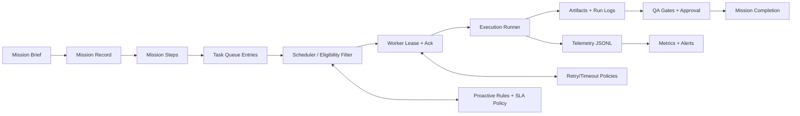
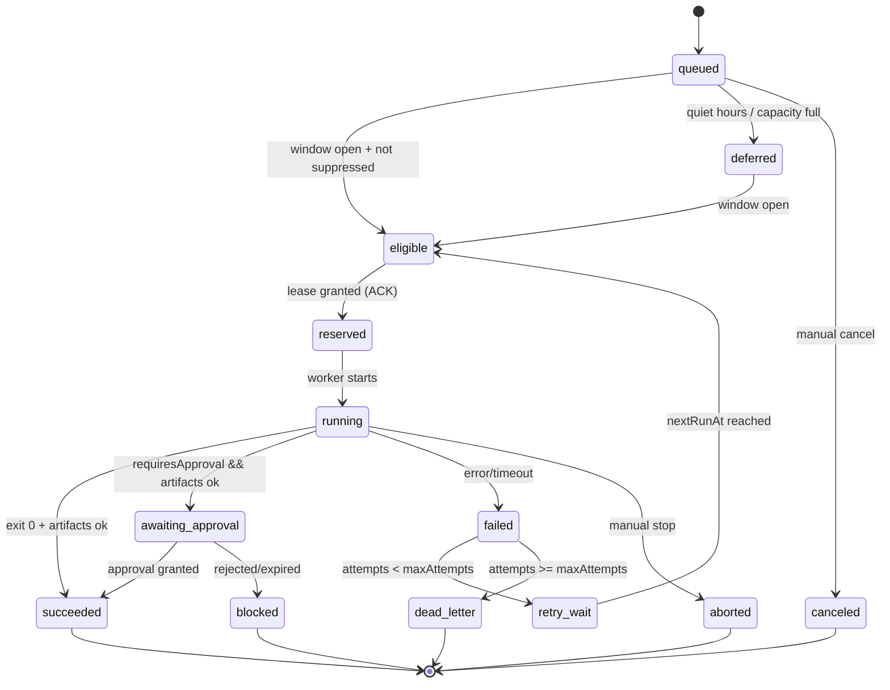
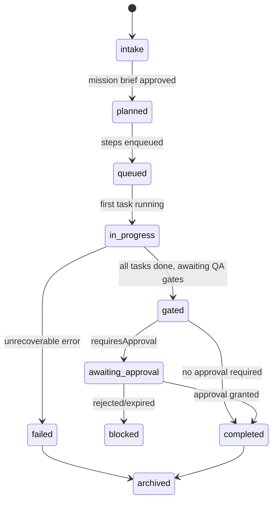

# Mission Runtime & Queue Execution State Machine

**Purpose:** define the **runtime semantics** for VentureOS missions and the task queue worker so execution is **auditable, deterministic, and SLA‑aligned**. This is the deep spec missing from the high‑level Mission Control + Proactive Engine docs.

**Related docs:**
- **MISSION_CONTROL.md** (mission lifecycle + gates)
- **PROACTIVE_ENGINE.md** (scheduler rules + queue schema)
- **SLA_POLICY.md** (time‑to‑ack/run + escalation)
- **RETRY_POLICY.md**, **TIMEOUT_POLICY.md**, **DEGRADATION_POLICY.md**
- **ERROR_TAXONOMY.md**, **RELIABILITY_PLAYBOOK.md**

---

## 1) Goals & Non‑Goals

### Goals
- Define **state machines** for **missions** and **queue entries**.
- Specify **data models** and **runtime fields** required for audit and replay.
- Establish **SLA semantics** (ack/run) and how they interact with scheduling and quiet hours.
- Provide **error handling, retry, suppression, idempotency, and recovery** behavior.
- Define **telemetry** (logs + metrics) and correlation keys.

### Non‑Goals
- Implementation details of the UI or dashboards.
- Replacing policy docs (this references them).
- Building a distributed queue; the v1 queue is file‑backed.

---

## 2) Core Concepts & Terminology

| Term | Meaning | Notes |
|---|---|---|
| **Mission** | Durable unit of work tied to business outcomes. | Created from a Mission Brief. |
| **Mission Step** | A discrete phase within a mission. | Can map to one or more tasks. |
| **Queue Entry / Task** | Executable unit with SLA tier + mission metadata. | Stored in `task-queue.json`. |
| **Attempt** | One execution try of a task. | Produces a run log record. |
| **Gate** | Required safety or QA check. | Sentinel / Verifier owned. |
| **Approval** | Explicit human decision step. | Blocks publish/close. |
| **Artifact** | Expected output files/links. | Used for completeness checks. |
| **Lease** | Temporary lock held by worker. | Prevents double execution. |
| **Ack** | Moment a worker **accepts** an eligible task. | SLA metric. |
| **Run** | Task execution start time. | SLA metric. |

---

## 3) Architecture Overview (Runtime)



**Key storage** (v1):
- Queue: `~/clawd/runtime/task-queue.json`
- Mission runtime: `~/clawd/runtime/missions/mission-*.json` *(proposed)*
- Runs: `~/clawd/runtime/logs/task_runs/YYYY-MM-DD.jsonl`

---

## 4) Data Model (Runtime Records)

### 4.1 Mission Record (proposed)
```json
{
  "missionId": "mission-2026-02-08-003",
  "businessUnit": "stanton-times",
  "missionType": "content",
  "title": "Draft weekly content calendar",
  "createdAt": "2026-02-08T00:12:00Z",
  "status": "in_progress",
  "steps": [
    {
      "stepId": "plan",
      "title": "Plan calendar",
      "taskIds": ["task-28b9f7b8"],
      "status": "running"
    }
  ],
  "expectedArtifacts": [
    "/obsidian/StantonTimes/2026/02/mission-brief.md",
    "/obsidian/StantonTimes/2026/02/content-calendar.md"
  ],
  "requiresApproval": true,
  "gateStatus": {
    "sentinel": "pending",
    "verifier": "blocked"
  },
  "sla": {
    "tier": "P2",
    "timeToAckTarget": "4h",
    "timeToRunTarget": "24h"
  },
  "metrics": {
    "ackLatencyMs": 0,
    "runLatencyMs": 0,
    "attempts": 1
  },
  "links": ["/obsidian/StantonTimes/2026/02/mission-brief.md"],
  "notes": "Route to Sentinel + Verifier before publish."
}
```

### 4.2 Queue Entry (task-queue.json)
Fields are defined in **PROACTIVE_ENGINE.md**; runtime additions below:

| Field | Type | Purpose |
|---|---|---|
| `status` | enum | Queue state machine (see below). |
| `lease` | object | Lease owner, start, expiry. |
| `ackAt` | timestamp | When worker accepted task. |
| `runAt` | timestamp | Execution start. |
| `completedAt` | timestamp | Success/terminal completion time. |
| `lastError` | string | Error summary (redacted). |
| `attempts` | number | Total attempts. |
| `suppressedUntil` | timestamp | For de‑dupe suppression windows. |

### 4.3 Task Run Log (JSONL)
```json
{
  "runId": "run-2026-02-08-14-00-12Z-0003",
  "taskId": "task-28b9f7b8",
  "missionId": "mission-2026-02-08-003",
  "businessUnit": "stanton-times",
  "tier": "P2",
  "attempt": 1,
  "status": "failed",
  "startedAt": "2026-02-08T14:00:12Z",
  "endedAt": "2026-02-08T14:03:44Z",
  "durationMs": 212000,
  "errorClass": "transient",
  "errorCode": "timeout",
  "timeoutSeconds": 900,
  "command": "python scripts/generate_calendar.py --unit stanton-times --week 6",
  "artifactCheck": {
    "expected": 2,
    "present": 1,
    "missing": ["/obsidian/.../content-calendar.md"]
  }
}
```

---

## 5) Queue Entry State Machine



### State Semantics
- **queued:** persisted and awaiting eligibility.
- **deferred:** held due to quiet hours or capacity. Requires `nextRunAt`.
- **eligible:** passes gating, can be leased by a worker.
- **reserved:** lease created; **ACK time** recorded.
- **running:** execution started; **RUN time** recorded.
- **awaiting_approval:** artifacts exist but approval pending.
- **failed:** terminal for this attempt; will transition to retry/dead‑letter.
- **dead_letter:** exhausted retries; alert escalation required.

---

## 6) Mission Runtime State Machine



**Rule:** a mission is complete only when **all expected artifacts exist** and required gates/approvals are recorded.

---

## 7) Execution Flow (Worker)

1. **Load queue** (read + lock file).
2. **Eligibility filter**:
   - quiet hours + tier rules (P0 allowed; others deferred)
   - suppression window / dedupeKey
   - capacity & concurrency caps
3. **Lease + ACK**:
   - mark `status=reserved`, set `lease.owner`, `lease.expiresAt`, set `ackAt`
4. **Start run**:
   - set `status=running`, `runAt`
   - spawn command with timeout policy
5. **Post‑run evaluation**:
   - exit code + timeout handling
   - artifact checks vs `expectedArtifacts`
   - if approval required → `awaiting_approval`
6. **Retry / dead‑letter**:
   - increment attempts
   - compute `nextRunAt` backoff
   - if exceeded → `dead_letter` + alert
7. **Persist run log** to JSONL and update mission record.

---

## 8) SLA Interaction Rules

**Source of truth:** `SLA_POLICY.md`.

### Definitions
- **Time‑to‑Ack:** `ackAt - createdAt` (queue entry accepted).
- **Time‑to‑Run:** `runAt - createdAt` (execution began).
- **Time‑to‑Complete:** `completedAt - createdAt` (optional reporting).

### Enforcement
- **Ack breach** → immediate alert for P0/P1; log only for P2/P3.
- **Run breach** → alert + escalation according to tier.
- **Quiet hours:** P1–P3 remain `deferred` until window opens (ack/run clocks **still tick** and may breach).

### Escalation Mapping (summary)
- **P0:** any breach → immediate alert.
- **P1:** ack/run breach → alert within 1h.
- **P2/P3:** log + notify on repeated breaches.

---

## 9) Error Handling & Recovery

### Error Classes
- **Transient:** retry with backoff (rate limit, network, tool timeouts).
- **Permanent:** no retry; move to dead‑letter (invalid config, missing auth).
- **User‑Blocked:** requires approval or input; set `blocked` + notify.

### Timeouts
- Use **TIMEOUT_POLICY.md** defaults; override per task if required.
- Timeout = `failed` + errorCode `timeout`, then retry logic.

### Crash Recovery
- On startup, **reclaim expired leases**:
  - `reserved`/`running` with lease expired → requeue (`eligible`) and log `lease_expired` event.

### Idempotency & Dedupe
- `dedupeKey` prevents duplicate work within a suppression window.
- Idempotent tasks must write artifacts atomically or use a temp path + rename.

---

## 10) Approval & Gate Handling

- **requiresApproval=true** → task transitions to `awaiting_approval` after artifacts pass basic checks.
- **Sentinel gate:** safety/guardrails compliance.
- **Verifier gate:** completeness + correctness.
- Approval record must include: approver, timestamp, notes, decision.

---

## 11) Telemetry & Observability

### Logs (JSONL)
- `task_runs/YYYY-MM-DD.jsonl`
- `queue_events/YYYY-MM-DD.jsonl` *(optional)*

### Required Metrics
| Metric | Type | Notes |
|---|---|---|
| `queue_depth{tier}` | gauge | queued + deferred + eligible |
| `ack_latency_ms{tier}` | histogram | created → ack |
| `run_latency_ms{tier}` | histogram | created → run |
| `success_rate{tier}` | ratio | succeeded / total |
| `retry_rate{tier}` | ratio | retries / total |
| `sla_breaches{tier,type}` | count | ack/run |

### Correlation Keys
- `missionId`, `taskId`, `runId`, `dedupeKey`, `businessUnit`

---

## 12) Degradation & Backpressure

- Apply **DEGRADATION_POLICY.md** when backlog exceeds thresholds.
- Reduce concurrency and defer non‑critical tiers.
- Emit alerts if queue depth > SLA targets or retries spike.

---

## 13) Open Questions

1. Should **quiet hours pause SLA clocks** for P1–P3 or continue counting?
2. Where should **mission runtime records** live long‑term: repo, Obsidian, or runtime only?
3. Should approval rejections **auto‑create a revision task** (default P2)?
4. Do we need a **dead‑letter requeue tool** with manual override?
5. How should **artifact validation** be formalized (schema, checksum, content checks)?
6. What is the **default lease duration** and how is it renewed?

---

## Appendix: Queue Entry Lifecycle Example

1. `queued` (P2 task created, 09:00)
2. `deferred` (quiet hours)
3. `eligible` (08:00 window opens)
4. `reserved` (08:02, ack)
5. `running` (08:03)
6. `failed` (timeout)
7. `retry_wait` (nextRunAt 09:00)
8. `eligible` → `reserved` → `running`
9. `awaiting_approval` (artifacts present)
10. `succeeded` (approval granted)
