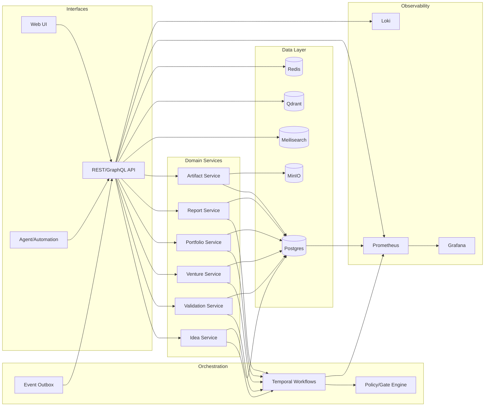
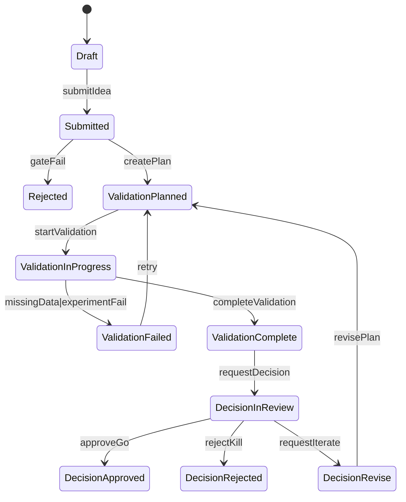
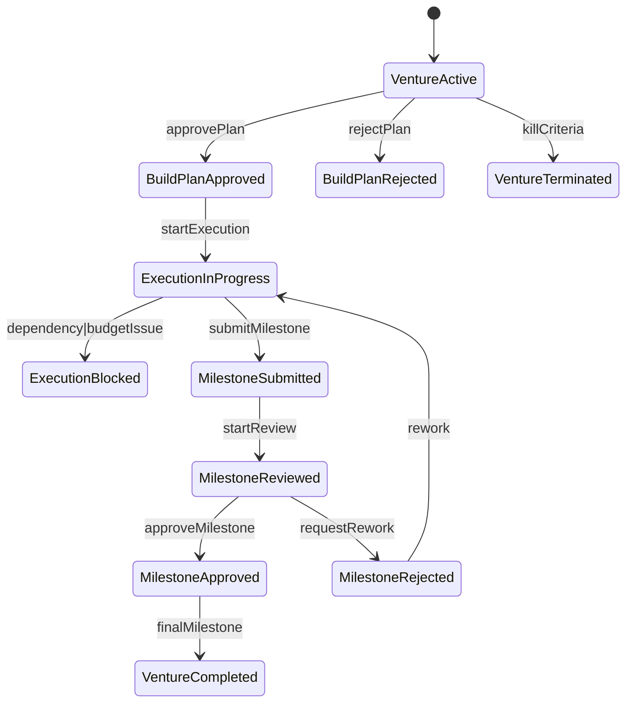
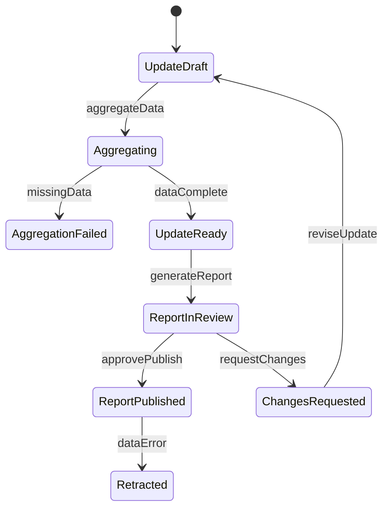

# VentureOS Spec Pack (Implementation‑Ready)

> **Goal:** Bulletproof workflow design and technical specification for local/free deployment.
> **Workflows:**
> 1) **Idea → Validation → Decision**
> 2) **Venture Build → Execution → Milestone Review**
> 3) **Portfolio Update → Stakeholder Report**

---

## 1) Overview & Principles

### 1.1 Objectives
- Provide **deterministic, auditable workflows** for venture creation and management.
- Deliver **high‑quality, gated decisions** with explicit evidence and approvals.
- Maintain **single source of truth** with strong integrity and traceability.

### 1.2 Design Principles
- **Workflow‑first:** Every step is explicit and testable.
- **Evidence‑driven:** Decisions require attached evidence bundles.
- **Idempotent & replayable:** Safe retries and deterministic outcomes.
- **Gated quality:** Approvals and policy checks are first‑class.
- **Local‑first + OSS:** Entire stack runs locally in Docker.

---

## 2) Architecture & Stack

### 2.1 Local/Free Stack
- **Postgres** – System of Record (SoR)
- **Temporal** – Workflow orchestration & durable state machines
- **Redis** – Cache, locks, light queueing, rate‑limiting
- **MinIO** – Object storage for artifacts (reports, evidence)
- **Qdrant** – Vector search
- **Meilisearch** – Full‑text search
- **Keycloak** – AuthN/AuthZ, RBAC
- **Prometheus + Grafana + Loki** – Metrics, dashboards, logs

### 2.2 System Diagram (Mermaid)


---

## 3) Integrations (Must‑Haves)
- **Obsidian**: Store long‑form artifacts (specs, memos) and sync into MinIO + Meilisearch.
- **GitLab**: Work items and execution tracking; sync task IDs into VentureOS.
- **Discord**: Approvals, alerts, status updates.

Integration pattern: **events + webhooks** using Postgres outbox + polling worker.

---

## 4) Data Model & Taxonomy (v1)

### 4.1 Core Entities
- **Idea** → **ValidationPlan** → **ValidationRun** → **Decision**
- **Venture** → **BuildPlan** → **ExecutionRun** → **MilestoneReview**
- **Portfolio** → **PortfolioUpdate** → **StakeholderReport**
- **Artifact** (Evidence, Report, Deck, Model, Metrics Snapshot)
- **PolicyGate** (approval & compliance)
- **EventOutbox** (immutable event stream)

### 4.2 Key Tables (high‑level)
**ideas**
- `id, title, owner_id, status, risk_level, priority, tags, created_at`

**validation_plans**
- `id, idea_id, hypothesis, success_metrics, timeline, status`

**validation_runs**
- `id, plan_id, outcome, metrics_json, status, completed_at`

**decisions**
- `id, idea_id, outcome, rationale, approved_by, status, created_at`

**ventures**
- `id, idea_id, owner_id, status, budget, priority, created_at`

**build_plans**
- `id, venture_id, milestones_json, status, approved_by`

**execution_runs**
- `id, venture_id, sprint_no, status, metrics_json`

**milestone_reviews**
- `id, venture_id, milestone_id, outcome, notes, approved_by`

**portfolios**
- `id, name, owner_id`

**portfolio_updates**
- `id, portfolio_id, period, status, metrics_json`

**stakeholder_reports**
- `id, update_id, format, status, published_at`

**artifacts**
- `id, parent_type, parent_id, type, minio_uri, metadata_json, created_at`

**policy_gates**
- `id, gate_type, entity_type, entity_id, required, status, approver_role`

**event_outbox**
- `id, type, entity_type, entity_id, payload_json, created_at`

### 4.3 Taxonomy
- **Status**: Draft | InReview | Approved | Rejected | Active | Paused | Completed | Failed | Archived
- **Priority**: P0 | P1 | P2 | P3
- **Risk**: Low | Medium | High | Critical
- **EvidenceType**: MarketResearch | UserInterview | Experiment | FinancialModel | Compliance
- **StakeholderType**: Founder | Operator | Investor | Advisor

---

# WORKFLOW 1 — Idea → Validation → Decision

## 5) Objective
Convert raw ideas into a **Go / Iterate / Kill** decision with attached evidence.

## 6) Actors
- Idea Owner, Validation Lead, Finance, Compliance, Exec Approver

## 7) State Machine (Mermaid)


## 8) Inputs / Outputs / Handoff Artifacts
**Inputs**
- Idea brief, market notes, budget assumptions

**Outputs**
- Validation plan, evidence bundle, decision memo

**Handoffs**
- `ValidationPlan.md`
- `EvidenceBundle/` (MinIO folder + metadata)
- `DecisionMemo.md/PDF`

## 9) Policy Gates
- **Strategic Fit** (Owner + Exec)
- **Budget Cap** (Finance)
- **Compliance** (if regulated domain)

## 10) API Contract (REST)
- `POST /ideas`
- `POST /ideas/{id}/submit`
- `POST /ideas/{id}/validation-plan`
- `POST /validation-plans/{id}/start`
- `POST /validation-plans/{id}/complete`
- `POST /ideas/{id}/decision`

## 11) Events
- `idea.submitted`
- `validation.plan.created`
- `validation.started`
- `validation.completed`
- `decision.requested`
- `decision.approved|rejected|revise`

## 12) Acceptance Criteria
- Decision memo always includes **evidence links** (MinIO URIs).
- Decision cannot be approved without **all required gates**.
- Workflow is **replayable** and **idempotent**.

---

# WORKFLOW 2 — Venture Build → Execution → Milestone Review

## 13) Objective
Execute approved ventures under milestone‑based governance.

## 14) Actors
- Venture Owner, Program Manager, Finance, Compliance, Exec Approver

## 15) State Machine (Mermaid)


## 16) Inputs / Outputs / Handoff Artifacts
**Inputs**
- Decision memo, budget approval, team allocation

**Outputs**
- Build plan, milestone review pack, execution reports

**Handoffs**
- `BuildPlan.md`
- `MilestoneReviewPack.md` + metrics snapshot
- `ExecutionReport.md`

## 17) Policy Gates
- **Budget Increase > Threshold** (Finance + Exec)
- **Compliance Review** (Milestone 1)
- **Kill Criteria** (performance below target)

## 18) API Contract (REST)
- `POST /ventures`
- `POST /ventures/{id}/build-plan`
- `POST /ventures/{id}/execution/start`
- `POST /ventures/{id}/milestones/{m}/submit`
- `POST /ventures/{id}/milestones/{m}/review`

## 19) Events
- `venture.activated`
- `build_plan.approved|rejected`
- `execution.started|blocked|completed`
- `milestone.submitted|approved|rejected`
- `venture.completed|terminated`

## 20) Acceptance Criteria
- Each milestone review includes **metrics snapshot + narrative**.
- Budget changes require explicit approval gate.
- Kill criteria is enforced by workflow policy.

---

# WORKFLOW 3 — Portfolio Update → Stakeholder Report

## 21) Objective
Generate accurate, auditable portfolio updates and stakeholder reports.

## 22) Actors
- Portfolio Manager, Finance, Compliance, Exec Approver

## 23) State Machine (Mermaid)


## 24) Inputs / Outputs / Handoff Artifacts
**Inputs**
- Venture KPIs, milestone summaries, financials

**Outputs**
- Portfolio snapshot, stakeholder report

**Handoffs**
- `PortfolioSnapshot.json/csv`
- `StakeholderReport.pdf/deck`

## 25) Policy Gates
- **Compliance Review** (pre‑publish)
- **Financial Approval** (external distribution)

## 26) API Contract (REST)
- `POST /portfolios/{id}/updates`
- `POST /portfolio-updates/{id}/aggregate`
- `POST /portfolio-updates/{id}/publish`
- `POST /stakeholder-reports/{id}/distribute`

## 27) Events
- `portfolio.update.created`
- `portfolio.update.aggregated`
- `stakeholder.report.reviewed|published|retracted`
- `report.distributed`

## 28) Acceptance Criteria
- Snapshot is reproducible from raw data.
- No publish without compliance gate pass.
- Report distribution is auditable.

---

## 29) Global API & Event Conventions

### 29.1 REST Patterns
- **Idempotent POST** via `Idempotency-Key` header
- `X-Request-Id` for traceability
- Pagination + filters on list endpoints

### 29.2 Event Schema
```json
{
  "id": "evt_...",
  "type": "idea.submitted",
  "ts": "ISO8601",
  "actor_id": "user_...",
  "entity_type": "idea",
  "entity_id": "idea_...",
  "payload": { }
}
```

### 29.3 Outbox Pattern
- `event_outbox` table polled by worker → dispatch webhook
- Ensures delivery even on crash/retries

---

## 30) QA & Test Plan (Global)

### 30.1 Test Types
- **Unit:** status transitions, policy validation
- **Workflow:** Temporal replay tests (happy + failure)
- **Contract:** REST + event schema tests
- **Integration:** Postgres/Redis/MinIO/Keycloak
- **Security:** RBAC boundary tests + audit logging
- **Performance:** aggregation and report generation

### 30.2 Critical Scenarios
- Gate rejection loops (strategic/budget/compliance)
- Partial data failure and recovery
- Idempotent retries across services
- Permission boundary enforcement

---

## 31) Release Criteria
- All workflows pass Temporal replay tests
- All required gates enforced and audited
- Reports reproducible from raw data
- Observability dashboards live
- Security/RBAC tests complete

---

## 32) Next Deliverables (If Approved)
1) Full schema DDL for Postgres
2) Temporal workflow definitions (pseudocode)
3) API OpenAPI spec
4) Docker Compose baseline
5) RACI + ownership map
