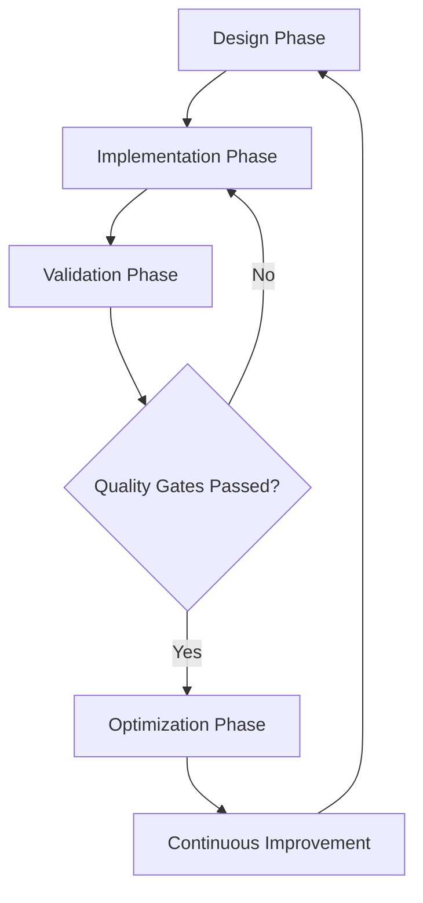

# Queue Management System - Execution Strategy

## 🔬 Execution Methodology: Multi-Agent Orchestrated Development

### Core Philosophy
- **Adaptive Progression**: Dynamic, intelligence-driven development
- **Continuous Validation**: Rigorous quality gates at each stage
- **Proactive Monitoring**: Real-time performance and quality tracking

### Phase Execution Framework

#### 1. Design Phase (Sub-Agent: Architecture)
- **Primary Tool:** Codex CLI
- **Objectives:**
  * Create detailed system architecture
  * Define component interactions
  * Establish initial design patterns

#### 2. Implementation Phase (Sub-Agent: Development)
- **Primary Tools:** 
  * Codex CLI (Code Generation)
  * Cursor CLI (Iterative Development)
- **Objectives:**
  * Translate architectural design into working code
  * Implement core system components
  * Maintain design integrity

#### 3. Validation Phase (Sub-Agent: Quality)
- **Primary Tool:** Gemini CLI
- **Objectives:**
  * Comprehensive code review
  * Performance analysis
  * Security assessment
  * Identify improvement opportunities

#### 4. Optimization Phase (Sub-Agent: Performance)
- **Primary Tools:**
  * Machine Learning Models
  * Performance Profiling Tools
- **Objectives:**
  * Identify performance bottlenecks
  * Implement optimization strategies
  * Validate performance improvements

### Quality Gates

#### Design Quality Criteria
- Clear, modular architecture
- Scalability considerations
- Flexible component design
- Minimal complexity

#### Implementation Quality Criteria
- 99.9% Test Coverage
- No critical security vulnerabilities
- Performance within specified targets
- Clean, maintainable code

#### Performance Quality Criteria
- 50% Latency Reduction Target
- 3-5x Current Scalability
- Resource-efficient design
- Adaptive load handling

### Monitoring & Feedback Loop

### Execution Workflow

1. **Architectural Design**
   - Codex generates initial architecture
   - Gemini reviews and refines design
   
2. **Component Implementation**
   - Codex generates initial code
   - Cursor performs iterative refinement
   - Automated tests validate functionality

3. **Comprehensive Validation**
   - Gemini performs in-depth code review
   - Performance and security analysis
   - Identify potential improvements

4. **Adaptive Optimization**
   - Machine learning models analyze performance
   - Suggest and implement optimizations
   - Validate improvements against criteria

### Tools & Technologies

- **Code Generation:** Codex CLI
- **Development:** Cursor CLI
- **Validation:** Gemini CLI
- **Tracking:** Plane.sh
- **Monitoring:** Prometheus/Grafana
- **Deployment:** Docker/Kubernetes

### Success Metrics

1. Architectural Elegance
2. Code Quality
3. Performance Improvement
4. Scalability
5. Security Robustness

### Continuous Improvement Mechanism

- Automated feedback collection
- Machine learning-driven strategy adaptation
- Regular architecture reviews
- Performance trend analysis

## Deployment Strategy

### Incremental Rollout
1. Local development environment
2. Staging with limited load
3. Canary deployment
4. Full production rollout

### Rollback Capabilities
- Automated version tracking
- Quick rollback mechanisms
- Minimal service disruption

---

**Last Updated:** 2026-02-01
**Version:** 1.0.0